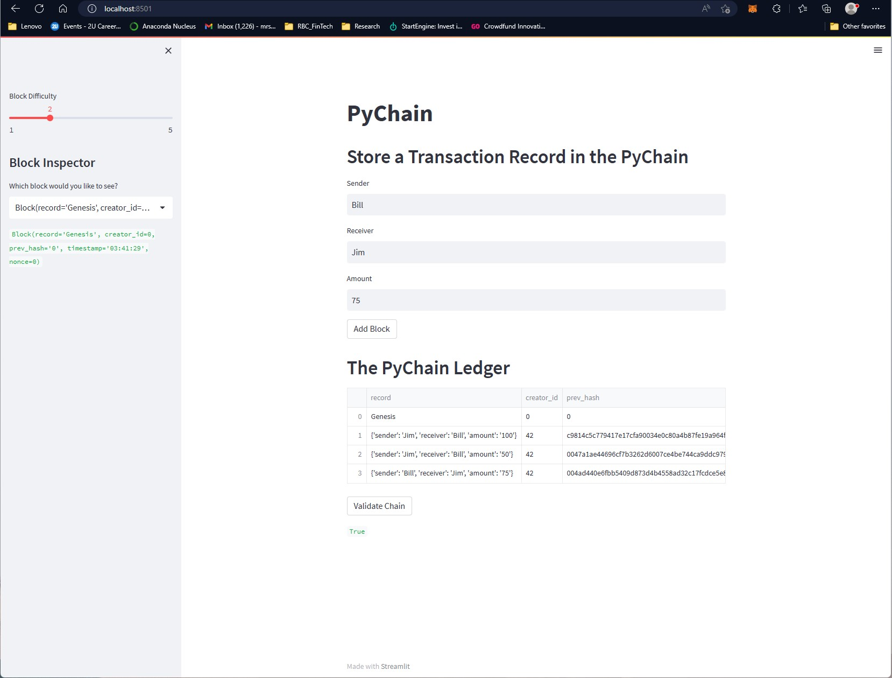
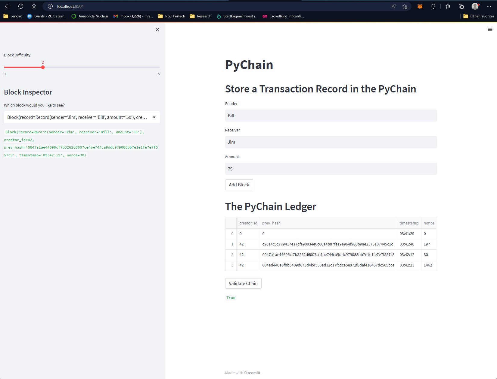

# RBC-HW18-BC-Challenge

## Blockchain Challenge Module (via Streamlit)
Note: All related development has been applied to a base python file within the "Starter Code" folder

## Please see below images of streamlit terminal commands rendered on local web-based host window.
Note: All required back-end adjustments completed with all blockchain functions rendering 'True' as expected

### Sample 1:

### Sample 2:

